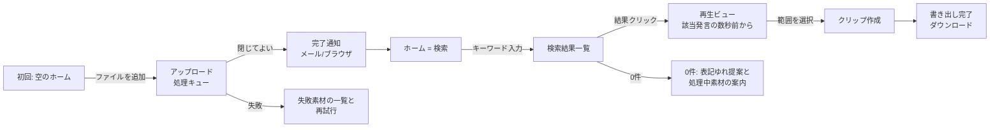

# UX設計: MediaMine

日付: 2026-07-08
関連bolt / ユーザーストーリー: 同boltの user-story.md(MVPスライス US-1〜US-4)

## 体験の方針

1. **検索が家** — アプリを開いたら常に検索ボックスが主役。ライブラリ管理は脇役に徹する。
2. **待たせるなら放置させる** — 文字起こしは分単位で待たせる処理。進捗を見張らせず、
   「閉じてよい、終わったら知らせる」を徹底する。
3. **確かめてから切り出す** — 再生確認を経ないと書き出しに進めない導線にし、
   「違う場面を切り出した」の手戻りを構造的に防ぐ。

## 画面フロー



- 離脱分岐: アップロード中にタブを閉じる → 処理は継続し、通知で復帰(US-1)。
- エラー分岐: 検索0件(E2)と文字起こし失敗(B2)を主要分岐として設計する。

## 情報設計

### 画面: ホーム(検索)(対応ストーリー: US-2)

- この画面の目的(1つ): 言葉で発言を見つける
- 優先表示(上から順に): 検索ボックス / 直近の検索結果 or 素材が処理中ならその件数 / 素材一覧への入口
- 主アクション(1つ): 検索実行 | 副アクション: ファイル追加

### 画面: 検索結果(対応ストーリー: US-2)

- この画面の目的(1つ): どの素材のどの発言かを見比べて選ぶ
- 優先表示: ヒット発言のテキスト(キーワードハイライト)/ 素材名とタイムスタンプ /
  話者ラベル(**表示のみ**。話者での絞り込みは「次」スライスであり MVP には含めない)
- 主アクション(1つ): 結果を再生 | 副アクション: 検索条件の修正

### 画面: 再生ビュー(対応ストーリー: US-3, US-4)

- この画面の目的(1つ): 場面を確かめて範囲を決める
- 優先表示: プレーヤー(該当発言の数秒前から)/ 同期ハイライトされる文字起こし / 範囲選択ハンドル
- 主アクション(1つ): この範囲でクリップ作成 | 副アクション: 検索結果に戻る

### 画面: 素材一覧(対応ストーリー: US-1)

- この画面の目的(1つ): 預けた素材の処理状態を把握する
- 優先表示: 状態バッジ(待機/処理中/完了/失敗)付きの素材リスト / 追加ボタン
- 主アクション(1つ): ファイル追加 | 副アクション: 失敗素材の再試行

## ワイヤーフレーム(テキスト)

判断が割れやすい「再生ビュー」のみ示す(確認と切り出しを1画面に同居させる判断のため):

```
+--------------------------------------------------+
| ← 検索結果に戻る          素材名 / 12:34-        |
|--------------------------------------------------|
|  [◀ プレーヤー ▶]  再生中: 12:31 〜              |
|  |----[========選択範囲========]------------|    |
|--------------------------------------------------|
|  文字起こし(自動スクロール・現在発言ハイライト) |
|   12:28 A: …それでですね                         |
| ▶ 12:31 B: ここが核心なんですが …               |
|   12:45 A: なるほど …                            |
|--------------------------------------------------|
|            [ この範囲でクリップ作成 ]            |
+--------------------------------------------------+
```

## 状態とエッジケース

| 画面 | 空状態 | エラー時 |
|---|---|---|
| ホーム(検索) | 素材0件: 検索ボックスの代わりにアップロード導線を主役にする | 検索失敗: 再試行の案内 |
| 検索結果 | 0件: 別キーワードを促す文言(意味検索・自動提案は「後」スライスのため行わない)+「処理中の素材N件は検索対象外」の明示 | — |
| 再生ビュー | — | 素材の再生失敗: 文字起こしテキストだけでも読める状態を維持 |
| 素材一覧 | 0件: 対応形式と目安処理時間を添えた追加導線 | 文字起こし失敗: 原因区分(形式非対応/音声不明瞭)と再試行 |
| クリップ作成・書き出し(US-4) | — | 書き出し失敗: 選択範囲を保持したまま原因表示と再試行。ダウンロード期限切れ: 再書き出し導線 |

## 未解決の設計課題

- 検索0件時の「処理中素材は対象外」の伝え方が十分か(誤って「無い」と判断される懸念)
  → プロトタイプ検証が必要。次回の UX調査仮説に追加する
- クリップ書き出しの待ち時間の体験(即時か、通知型か)は処理コスト(H6)に依存
  → 要件フェーズで H6 の実測結果とあわせて判断
- 話者ラベルの誤りをユーザーが直せるべきか(MVPで持つか)→ 要件フェーズでスコープ判断
