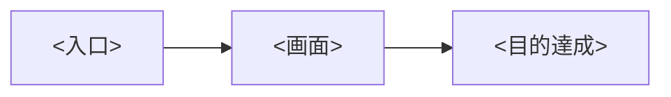

# UX設計: <テーマ>

日付:
関連bolt / ユーザーストーリー:

## 体験の方針

<!-- この体験で最重要の設計判断を1〜3行で。
     例: 「承認は1タップで完結。設定は初回のみで日常UIに出さない」 -->

## 画面フロー

<!-- ユーザーストーリー(MVPスライス)ごとに、入口から目的達成までの画面遷移。
     mermaid か箇条書きで。ハッピーパスと主要な離脱・エラー分岐を含める -->



## 情報設計

<!-- 主要画面ごとに: 何を最優先で見せるか(1画面1目的)、表示する情報の優先順位、
     ナビゲーション構造 -->

### 画面: <名前>(対応ストーリー: US-n)

- この画面の目的(1つ):
- 優先表示(上から順に):
- 主アクション(1つ)/副アクション:

## ワイヤーフレーム(テキスト)

<!-- 必要な画面のみ。ASCII/箇条書きで構成を示す。ビジュアルデザインはしない -->

```
+----------------------------------+
| <ヘッダー>                        |
|----------------------------------|
| <主要素>                          |
| [主アクション]                    |
+----------------------------------+
```

## 状態とエッジケース

<!-- 空状態(初回)・ローディング・エラー・権限なし、の各状態で何を見せるか -->

| 画面 | 空状態 | エラー時 |
|---|---|---|
| | | |

## 未解決の設計課題

<!-- 要件フェーズ・実装フェーズに引き継ぐ判断。プロトタイプ検証が必要な仮説があれば
     ux-research の追加仮説として起票する -->
